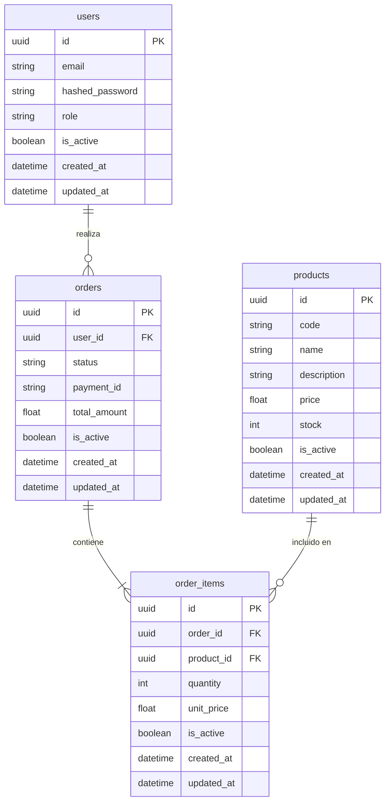

# Diagrama Entidad-Relación (DER) - MEDISTOCK

```mermaid
erDiagram
    users {
        uuid id PK
        string email
        string hashed_password
        string role
        boolean is_active
        datetime created_at
        datetime updated_at
    }

    products {
        uuid id PK
        string code
        string name
        string description
        float price
        int stock
        boolean is_active
        datetime created_at
        datetime updated_at
    }

    orders {
        uuid id PK
        uuid user_id FK
        string status
        string payment_id
        float total_amount
        boolean is_active
        datetime created_at
        datetime updated_at
    }

    order_items {
        uuid id PK
        uuid order_id FK
        uuid product_id FK
        int quantity
        float unit_price
        boolean is_active
        datetime created_at
        datetime updated_at
    }

    users ||--o{ orders : "realiza"
    orders ||--|{ order_items : "contiene"
    products ||--o{ order_items : "incluido en"
```
